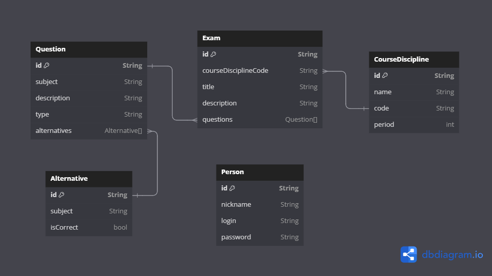

# Pratiquei Exames de ADS (backend)

**Colaboradores**: 
  - @Caio Donat

---

## Info

[](https://dbdiagram.io/embed/65e6865ecd45b569fb853dba)

## Tech Stack

### Main Techs

-   Language : `TypeScript` (5.1.3)
-   Web Application framework : `NestJS` (10.0.0)
-   Database : `PostgreSQL` (15.4)
-   Object-Relational Mapping (ORM) : `Prisma` (5.4.2)
-   Package manager : `NPM` (9.8.1)

### Libraries

-   Build : `Node` (20.8.0)
-   Schema validation : `Zod` (3.22.4)
-   API documentation : `nestjs/swagger` (7.1.13) | `OpenAPI` (3.0.0)
-   Technical documentation : `Compodoc` (?)

### Development Environment

-   OS : `Win` (11) | `WSL 2` (Ubuntu 22.04) | `Dev Container`
-   IDE : `VS Code` (^1.83.0)

---

## Utilities

### Get repo statistics

```bash
tokei --exclude *.sql *.toml --sort code
```