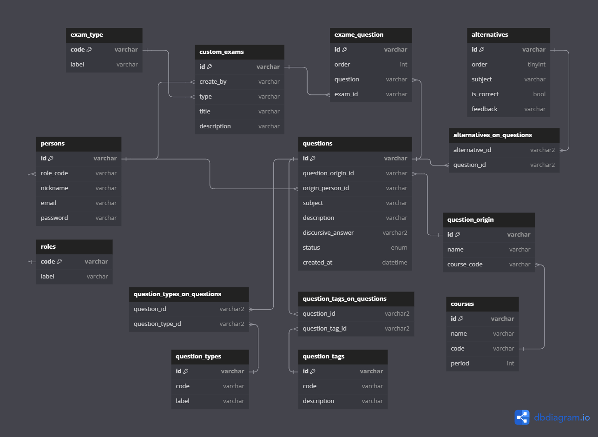

# Pratiquei Exame (backend)

**Colaboradores**:

- @Caio Donat <cdonat.dev@gmail.com>

---

## Info

[](https://dbdiagram.io/embed/65e6865ecd45b569fb853dba)

## Tech Stack

### Main Techs

- Language : `TypeScript` (5.1.3)
- Web Application framework : `NestJS` (10.0.0)
- Database : `SQLite` (^5.1.7)
- Object-Relational Mapping (ORM) : `TypeORM` (0.3.20)
- Package manager : `npm` (9.8.1)

### Libraries

- Build : `Node.js` (20.8.0)
- Schema validation : `class-validator` (^0.14.1)
- API documentation : `nestjs/swagger` (^7.3.1) | `OpenAPI` (3.0.0)
- Technical documentation : `Compodoc` (?)

### Development Environment

- OS : `Win` (11) | `WSL 2` (Ubuntu 22.04) | `Dev Container`
- IDE : `VS Code` (^1.83.0)

---

## Utilities

### Get repo statistics

```bash
tokei --exclude *.sql *.toml --sort code
```
